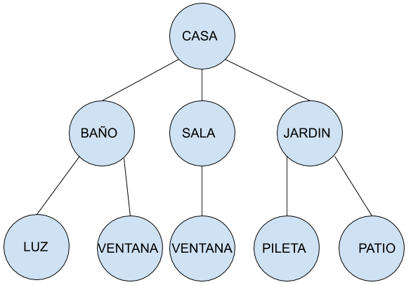

# Inducción a mosquitto

[Contexto](#contexto)
- [Dispositivo que se suscribe a un tópico](#dispositovosuscribe)
- [Dispositivo que publica en un tópico](#dispositovopublica)
- [Dispositivo que se suscribe a tópicos bajo el mismo nodo](#dispositovosuscribenodo)
- [Dispositivo que se suscribe al mismo nivel](#dispositovosuscribenivel)

# Contexto <a name="contexto"></a>


Se supone querer administrar todos los dispositivos que se encuentran en una casa inteligente. Se la puede dividir en lugares lógicos/físicos donde los dispositivos tienen la posibilidad de publicar y/o suscribirse a eventos que ocurran en esos lugares lógicos/físicos. La representación de los lugares lógicos/físicos se puede hacer mediante un árbol.



Un tópico es un texto con un formato especial que representa una rama del árbol.
algunos tópicos válidos:

- CASA/BAÑO/LUZ
- CASA/JARDIN

## Dispositivo que se suscribe a un tópico <a name="dispositovosuscribe"></a>
Una dispositivo lumínico ubicado en el baño se suscribe al tópico "CASA/BAÑO/LUZ" y escucha lo que alguien publique en dicho tópico.
```bash
mosquitto_sub -t "CASA/BAÑO/LUZ"
```

## Dispositivo que publica en un tópico <a name="dispositivopublica"></a>
Un dispositivo manda el mensaje "on" a la luz del baño.
```bash
mosquitto_pub -t "CASA/BAÑO/LUZ" -m "on"
```
Como el dispositivo lumínico esta suscripto en el topico "CASA/BAÑO/LUZ" recibe el mensaje "on" y puede actuar frente a esa acción.

## Dispositivo que se suscribe a tópicos bajo el mismo nodo <a name="dispositovosuscribenodo"></a>
Si se quisiera escuchar todo lo que ocurre en un tópico parcial (sin importar sus nodos hijos) se hace de la siguiente manera:
```bash
mosquitto_sub -t "CASA/BAÑO/#"
```
Entonces un dispositivo podría escuchar toda la actividad que hay en el baño (tópicos y mensajes). De esta manera se puede escalar ya que, si se suman mas lugares lógicos/físicos dentro del baño, el dispositivo seguiría escuchando sin importar cuantos nodos hijos tenga.
También se evita hacer múltiples suscripciones.

## Dispositivo que se suscribe al mismo nivel <a name="dispositovosuscribenivel"></a>
Si quisieramos escuchar que está pasando en todas las ventanas de la casa nos podemos suscribir de la siguiente manera
```bash
mosquitto_sub -t "CASA/+/VENTANA"
```
Esa suscripción escucha en los siguientes tópicos segun el árbol que manejamos.
```
CASA/BAÑO/VENTANA
CASA/SALA/VENTANA
```

### Ejemplos de uso por consola de mosquitto

```
bash
mosquitto_sub -h localhost -t RAIZ/#
mosquitto_pub -h localhost -t RAIZ/NODO -m "message_to_send"
```
Son ejemplos de como se utiliza el cliente de MQTT.

Para usar el cliente remoto reemplazar localhost por la direccion ip donde esta ejecutando el servidor mosquitto.

Ejemplo: si se levantó el docker-compose en su maquina, y su ip es 20.1.2.123. El cliente remoto debe ser

mosquitto_sub -h 20.1.2.123 -t RAIZ/#
